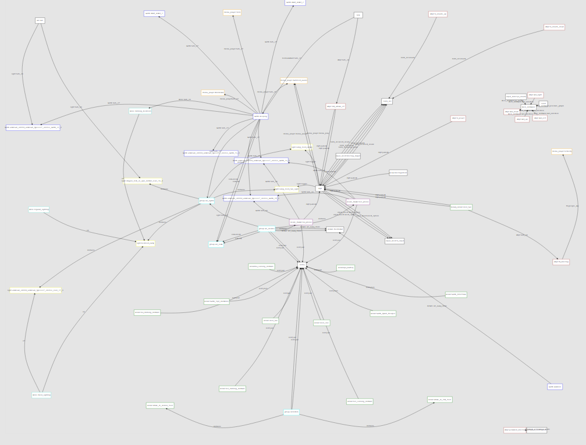

# home-assistant-graph



## Install

`pip install hagraph`

## Run

`python3 -m hagraph -i <path/to/configuration.yaml> -o <path/to/output.[dot/png/jpg/svg/etc]>`

## Suggested Integration

### Home Assistant Configuration

```yaml
panel_iframe:
  graph:
    title: Graph
    icon: mdi:vector-polyline
    url: "https://your.hass/local/graph.html"

shell_command:
  generate_graph: "python3 -m hagraph -i <path/to/configuration.yaml> -o <path/to/output.[dot/png/jpg/svg/etc]>"

automation:
  - alias: Generate graph
    trigger:
      platform: event
      event_type: homeassistant_start
    action:
      - service: shell_command.generate_graph
```

### graph.html

In your `<Home Assistant configuration directory>/www`:
```html
<html>
<script src="/local/svg-pan-zoom.min.js"></script>
<head>
        <meta http-equiv="cache-control" content="max-age=0" />
        <meta http-equiv="cache-control" content="no-cache" />
        <meta http-equiv="expires" content="0" />
        <meta http-equiv="expires" content="Tue, 01 Jan 1980 1:00:00 GMT" />
        <meta http-equiv="pragma" content="no-cache" />
        <style>
                body { margin: 0; padding: 0; }
        </style>
</head>
<body>
<object id="graph" data="/local/graph.svg" type="image/svg+xml" style="width: 100%; height: 100%; background-color: #E5E5E5">
</object>
    <script>
      window.onload = function() {
        svgPanZoom('#graph', {
          controlIconsEnabled: false,
          zoomScaleSensitivity: 0.7,
          minZoom: 1
        });
      };
    </script>
</body>
</html>
```

Be sure to get [svg-pan-zoom.min.js](https://github.com/ariutta/svg-pan-zoom) as well.
